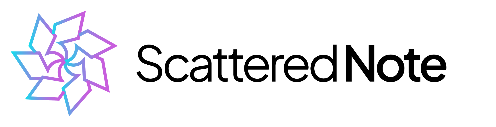
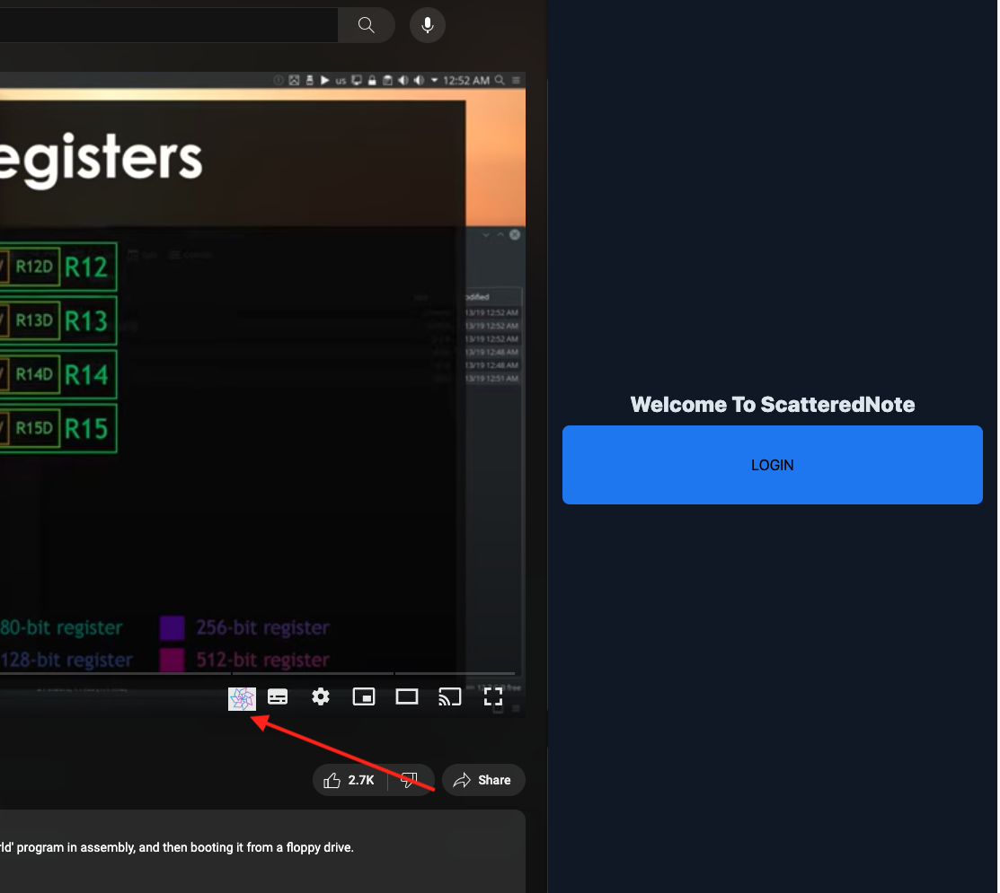
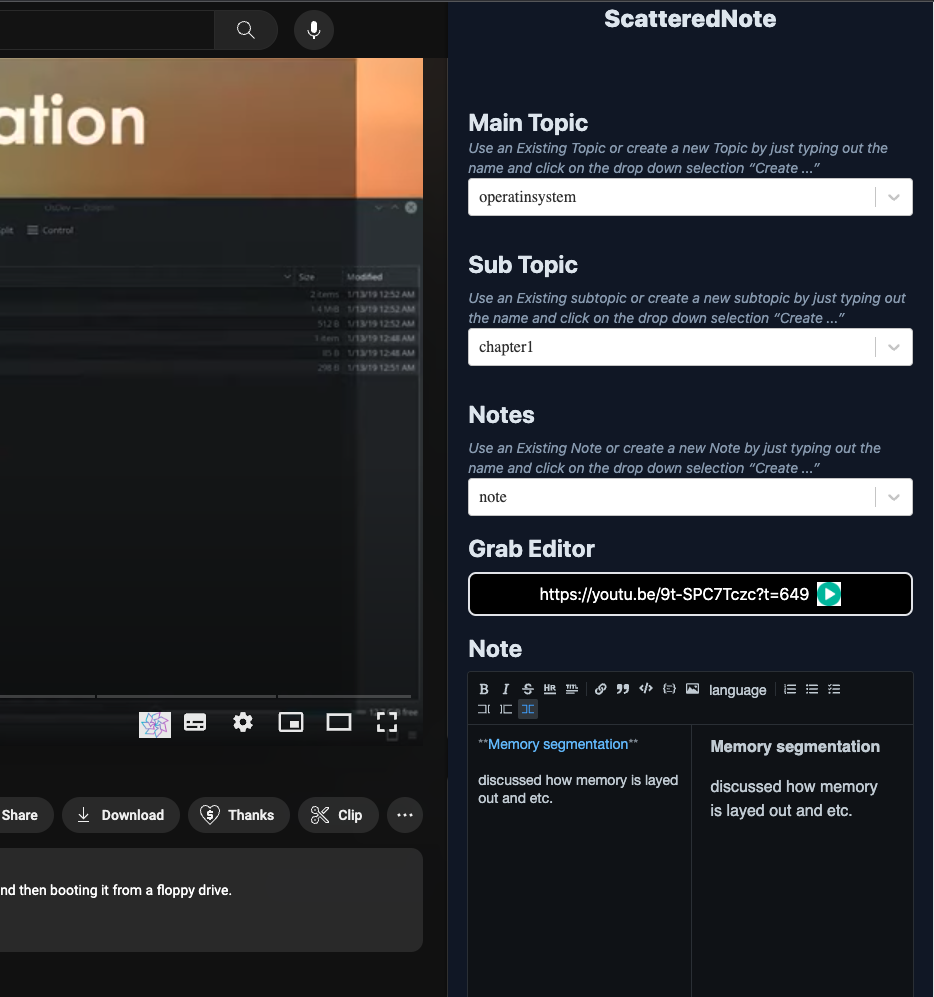
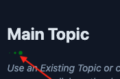
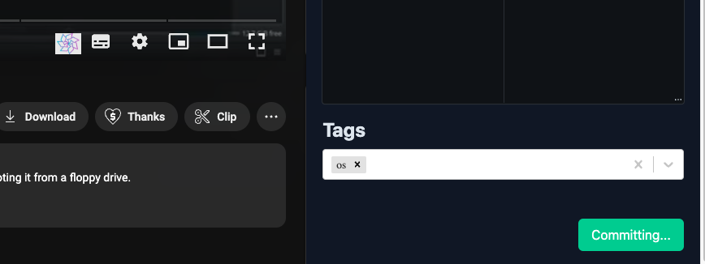
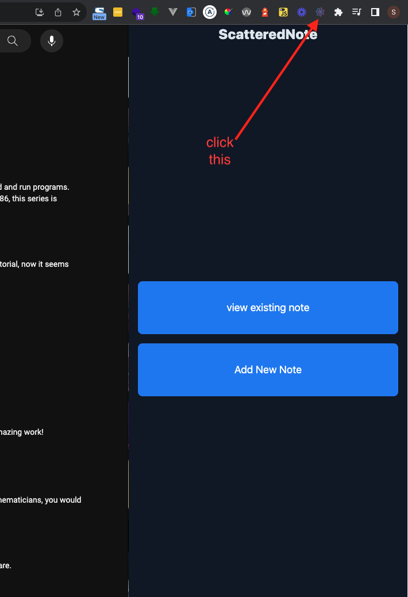
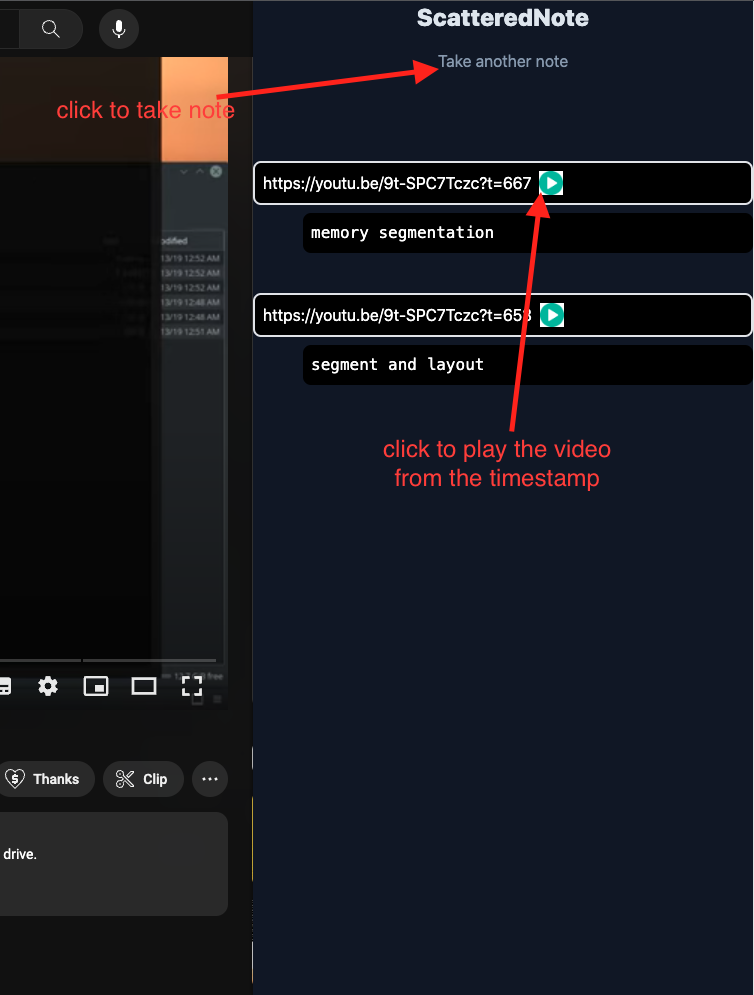
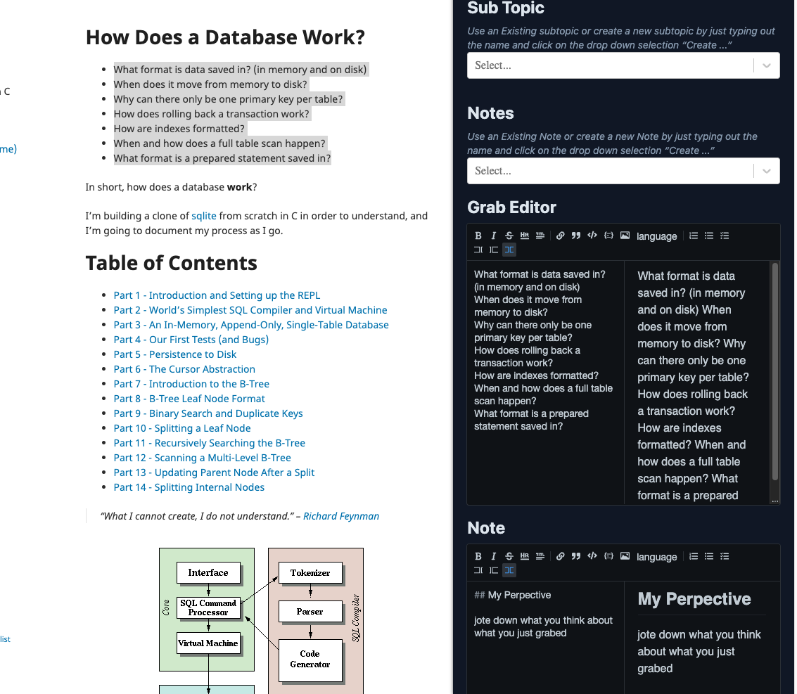

# ScatteredNote-chrome - v0.2

simple ui to grab content and take note easily: enabling querying note intelligently, sharing note and some functionality of enterprise note taking system

## Goals and Objective

* Make Note-taking a by-product of your main task without getting distracted from your current main goal.
* Easy to spin up to grab content and take note to reduce procastination. Hence every worth knowledge are archive and jotted down to be in peace with forgetting
* Simple UI and workflow to ensure the user is never trapped while taking notes. Ensure the user falls back to the main task immediately after quick note-taking
* Embrace mental model of capturing information atomically and backing it up with your insight.
* Query and chat with your archived knowledge for quick insight
* Minimize effort in moving things around and ensure note organization is with less to no effort.
* keep track of note per website and youtube videos.

## How to use

1. Install and pin extension
2. Go to https://www.scatterednote.com/ and signin. 
3. to capture note for youtube video:
  * click on the icon in the youtube tab
  

  * take note

  

  * before taking note, be aware of the loader below **Main Topic** , this indicate loading of file

  

  * click commit to submit note

  

  * once commit is done the interface should be gone. Hence you can repeat the first steps again or you click on scatterednote icon on your tab header and you will get this

  

  * click on **view existing note**

  

For notmal website same thing similar to the youtube video. click on the icon on tab header and you can jott down your note.

